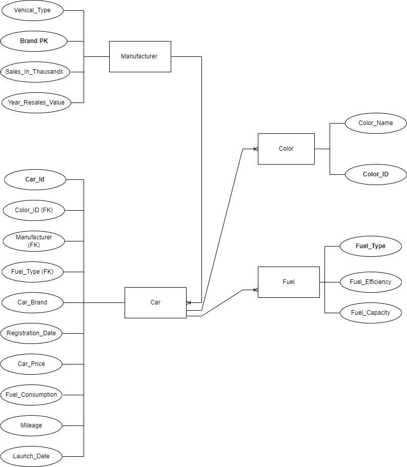
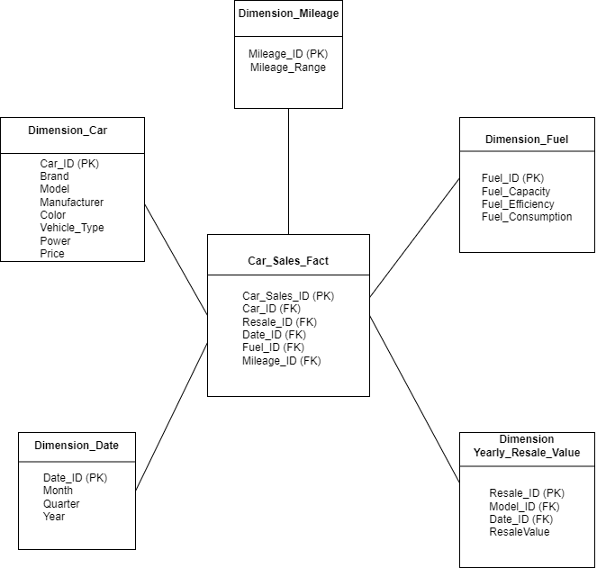

# Car Sales Analysis

A Business Intelligence and data analysis project exploring car sales, pricing, fuel efficiency, engine performance, and vehicle resale values using **Python, Pandas, Jupyter Notebook, and Tableau**.

## Project Overview

This project analyses two car-related datasets to identify patterns and relationships that can support business and sales decision-making.

The analysis focuses on questions around:

- Car sales by brand and model
- Vehicle pricing
- Fuel efficiency
- Engine power and performance
- Mileage
- Vehicle types
- Resale values

The project combines **data cleaning, data integration, data modelling, exploratory analysis, and business intelligence visualisation**.

## Business Questions

The analysis was designed around the following questions:

1. How do car sales vary across different brands or models?
2. How does fuel efficiency vary across different car models?
3. Which vehicle features have a stronger relationship with car sales?
4. How does engine power relate to car price and mileage?
5. Which vehicle types are associated with higher resale values?

These questions were used to guide the data preparation, modelling, and visualisation process.

## Datasets

Two datasets were used in the analysis:

| Dataset | Source | Size |
|---|---|---:|
| German Car Insights | Kaggle | ~100,000 entries, 15 columns |
| Car Sales | Kaggle | 153 entries, 16 columns |

The datasets contain information related to vehicle characteristics, pricing, sales, fuel information, mileage, and resale values.

## Data Processing

### Data Transformation

The datasets were prepared for analysis using Python and Pandas.

The preparation process included:

- Loading CSV datasets into Jupyter Notebook
- Identifying relevant attributes
- Removing irrelevant fields
- Identifying primary and foreign key relationships
- Standardising manufacturer and model names
- Preparing data for integration with Tableau

Examples of removed or simplified attributes include:

- `Unnamed: 0`
- `Latest Launch`
- `Simplified Model`

### Data Integration

The datasets were integrated using relationships between relevant vehicle attributes.

An inner join was used to remove non-matching records.

The integrated data was organised into analytical dimensions including:

- Dimension_Car
- Dimension_Date
- Dimension_Fuel
- Dimension_Mileage
- Dimension_Yearly_Resale_Value

### Data Cleaning

The data cleaning process included:

- Identifying missing values
- Handling missing numerical values using median values
- Handling missing categorical values using mode values
- Converting numeric fields stored as strings
- Removing non-numeric characters from power-related fields
- Converting `power_kw` and `power_ps` into numeric formats
- Standardising inconsistent values across datasets

## Data Modelling

Two complementary models were created to understand and prepare the data for analysis.

### Entity Relationship Diagram

The ERD represents relationships between the source entities, including:

- Car
- Manufacturer
- Color
- Fuel

### Star Schema

A star schema was designed for Business Intelligence analysis.

The model contains:

**Fact Table**

- `Car_Sales_Fact`

**Dimensions**

- `Dimension_Car`
- `Dimension_Date`
- `Dimension_Fuel`
- `Dimension_Mileage`
- `Dimension_Yearly_Resale_Value`

## Analytics & Visualisation

The prepared data was analysed and visualised using Tableau.

### Analysis 1 — Sales by Brand / Model

A bar chart was used to compare car sales across different brands and models.

**Key finding:** Ford F-Series had the highest sales volume among the models analysed.

### Analysis 2 — Price vs Fuel Efficiency

A scatter plot was used to investigate the relationship between vehicle price and fuel efficiency.

**Key finding:** Higher-priced vehicles generally showed lower fuel efficiency in the analysed data.

### Analysis 3 — Vehicle Features vs Sales

Multiple vehicle characteristics were compared against sales, including:

- Curb weight
- Engine size
- Horsepower

This analysis was used to investigate which vehicle characteristics showed stronger relationships with sales.

### Analysis 4 — Engine Power vs Price and Mileage

Scatter plots were used to investigate relationships between engine power, vehicle price, and mileage.

### Analysis 5 — Vehicle Type vs Resale Value

Vehicle types were compared against yearly resale values to identify differences in resale performance.

**Key finding:** Passenger vehicle types showed higher resale values than regular cars in the analysed dataset.

## Key Findings

The analysis identified several notable patterns:

- Ford F-Series had the highest sales volume among the models analysed.
- Higher-priced vehicles generally showed lower fuel efficiency.
- Engine size and horsepower showed notable relationships with sales across manufacturers.
- Passenger vehicle types showed higher resale values than regular cars.
- Data quality and consistency had a significant impact on the preparation process.

These findings are observations from the analysed datasets and should not be interpreted as universal market conclusions.

## Challenges Encountered

Several data preparation challenges were identified:

- A large number of missing values
- Inconsistent data organisation
- Numeric values stored as strings
- Inconsistent manufacturer and model naming
- Limited matching relationships between some primary and foreign key values

These issues required additional cleaning, standardisation, and transformation before the data could be used effectively for analysis.

## Tools & Technologies

| Tool / Technology | Purpose |
|---|---|
| Python | Data processing and transformation |
| Pandas | Data cleaning and manipulation |
| Jupyter Notebook | Data preparation and analysis |
| Tableau | Business intelligence and visualisation |
| CSV | Dataset format |
| PlantUML / ERD modelling | Data and system modelling |

## Repository Structure

car-sales-analysis/
│
├── car_sales_data_processing.ipynb
├── car_sales_df.csv
├── gcar_data_df.csv
├── ERD.jpg
├── star_schema.png
├── car_sales_analysis_report.pdf
└── README.md

## Reproducibility

The main data preparation workflow is documented in:

car_sales_data_processing.ipynb

The notebook demonstrates the data preparation and transformation steps used before the data was analysed and visualised.

The processed datasets are included in the repository for reference.

Business & Process Analysis Perspective

This project also demonstrates skills relevant to Process Analyst and Business Analyst roles.

The analysis followed a structured process:

Business Questions
        ↓
Data Collection
        ↓
Data Understanding
        ↓
Data Cleaning
        ↓
Data Integration
        ↓
Data Modelling
        ↓
Analysis
        ↓
Visualisation
        ↓
Business Insights

## The project demonstrates experience with:

Translating business questions into analytical requirements
Identifying relevant data sources
Understanding data quality issues
Cleaning and standardising business data
Integrating multiple datasets
Modelling data for BI analysis
Selecting appropriate visualisations
Interpreting analytical results
Communicating findings through reports and dashboards
Future Improvements

## Potential improvements include:

Using larger and more representative datasets
Adding more advanced statistical analysis
Investigating correlations between additional vehicle characteristics
Adding interactive Tableau dashboards
Introducing automated data-quality checks
Adding more detailed business recommendations
Validating findings with domain experts
Extending the analysis with predictive modelling
Project Status

Completed academic/portfolio Business Intelligence and data analysis project demonstrating data preparation, integration, modelling, visualisation, and business insight generation.
